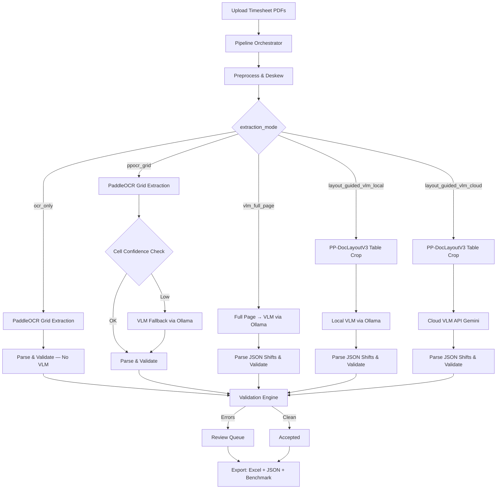

# Timesheet OCR

<div align="center">
  <h3>A privacy-first pipeline to extract, validate, and structure data from scanned handwritten home-health timesheets using 5 distinct approaches.</h3>
</div>

<br/>

Designed to convert messy, handwritten PDF uploads into structured, validated Excel databases while benchmarking extraction quality across OCR-only, hybrid, and full VLM approaches.

---

## 🧠 System Architecture



---

## 🔬 5 Extraction Approaches

| # | Approach | Mode | Description | Speed | Best For |
|---|----------|------|-------------|-------|----------|
| 1 | **OCR Only** | `ocr_only` | PaddleOCR grid extraction with zero VLM involvement. Empty cells stay empty. | ⚡⚡⚡ Fastest | Baseline comparison, printed forms |
| 2 | **OCR + VLM Fallback** | `ppocr_grid` | PaddleOCR grid extraction with per-cell VLM fallback on low confidence. | ⚡⚡ Fast | Standardized forms, privacy-first |
| 3 | **VLM Full Page** | `vlm_full_page` | Entire page sent to local VLM for structured JSON extraction. | ⚡ Slow | Messy layouts, cursive handwriting |
| 4 | **Layout-Guided VLM (Local)** | `layout_guided_vlm_local` | PP-DocLayoutV3 detects table zone, crops it, sends to local VLM. | ⚡ Slow | Balance of accuracy + privacy |
| 5 | **Layout-Guided VLM (Cloud)** | `layout_guided_vlm_cloud` | PP-DocLayoutV3 detects table zone, crops it, sends to cloud VLM (Gemini). | ⚡⚡ Moderate | Maximum accuracy, API available |

### Workflow Diagrams

Detailed Mermaid diagrams for each approach are in the [`workflows/`](workflows/) directory:

- [`workflows/ocr_only_flow.md`](workflows/ocr_only_flow.md)
- [`workflows/ppocr_grid_flow.md`](workflows/ppocr_grid_flow.md)
- [`workflows/vlm_full_page_flow.md`](workflows/vlm_full_page_flow.md)
- [`workflows/layout_guided_vlm_local_flow.md`](workflows/layout_guided_vlm_local_flow.md)
- [`workflows/layout_guided_vlm_cloud_flow.md`](workflows/layout_guided_vlm_cloud_flow.md)
- [`workflows/ground_truth_comparison.md`](workflows/ground_truth_comparison.md) — Ground truth comparison workflow

---

## 📊 Benchmark Results

Results from processing **Sample Timesheets** (2 pages, 7 expected shifts):

| Metric | OCR Only | OCR + VLM Fallback | VLM Full Page | Layout-Guided VLM (Local) | Layout-Guided VLM (Cloud) |
|--------|----------|-------------------|---------------|--------------------------|--------------------------|
| **Processing Time (s)** | **70.0** | 107.1 | 436.5 | 429.1 | 85.0 |
| **Rows Extracted** | 5 | 6 | 5 | 6 | 5 |
| **Accepted Rows** | 0 | 1 | 2 | 3 | **5** |
| **Flagged Rows** | 5 | 5 | 3 | 3 | **0** |
| **Mean Confidence** | 0.883 | 0.873 | **0.900** | **0.900** | **0.900** |
| **VLM Fallbacks** | **0** | 6 | 0 | 0 | 0 |
| **Hours Mismatch Rate** | **0.0%** | **0.0%** | 60.0% | 50.0% | **0.0%** |
| **Field Missing Rate** | 100.0% | 83.3% | **0.0%** | **0.0%** | **0.0%** |
| **Mean CER** | 0.342 | 0.398 | 0.400 | 0.233 | **0.200** |

### Key Findings

- **Layout-Guided VLM (Cloud)** achieves the highest quality: 100% acceptance rate, 0% field missing, lowest CER
- **OCR Only** is the fastest but produces 0 accepted rows — handwritten text requires VLM assistance
- **OCR + VLM Fallback** uses 6 VLM calls but still only accepts 1 of 6 rows — per-cell fallback is insufficient for heavily handwritten forms
- **VLM Full Page** and **Layout-Guided VLM (Local)** are slowest due to local model inference but produce reasonable results

---

## 📏 Ground Truth Comparison & Confusion Matrix

The pipeline includes a ground truth comparison workflow that evaluates extraction accuracy against manually-annotated reference data:

### How It Works

1. **Fill in ground truth**: Manually enter expected values in `output/ground_truth.xlsx`
   - Columns: `source_file`, `date`, `total_hours`, `time_in`, `time_out`, `employee_name`
2. **Run all 5 approaches**: Use `scripts/run_all_approaches.py` to generate benchmark data
3. **Generate combined metrics**: Run `scripts/create_combined_results.py` to create `benchmark_combined.xlsx`
4. **Compare against ground truth**: Run `scripts/compare_ground_truth.py` to evaluate accuracy

### Confusion Matrix Metrics

The comparison script computes a full confusion matrix for each approach:

| Metric | Definition |
|--------|------------|
| **True Positives (TP)** | Rows accepted by pipeline AND correct vs ground truth |
| **True Negatives (TN)** | Rows flagged/failed by pipeline AND actually incorrect |
| **False Positives (FP)** | Rows accepted by pipeline BUT incorrect (bad acceptance) |
| **False Negatives (FN)** | Rows flagged/failed by pipeline BUT actually correct (over-rejected) |

### Derived Accuracy Metrics

| Metric | Formula | Interpretation |
|--------|---------|----------------|
| **Precision** | TP / (TP + FP) | Of accepted rows, how many are correct? |
| **Recall** | TP / (TP + FN) | Of correct rows, how many were accepted? |
| **F1 Score** | 2 × (Precision × Recall) / (Precision + Recall) | Harmonic mean of precision and recall |
| **False Positive Rate** | FP / (FP + TN) | Of wrong rows, how many were incorrectly accepted? |
| **False Negative Rate** | FN / (TP + FN) | Of correct rows, how many were incorrectly rejected? |
| **Accuracy** | (TP + TN) / Total | Overall correct classification rate |

### Tolerance Thresholds

- **Hours**: Within ±0.25 hours (15 minutes)
- **Time In/Out**: Within ±30 minutes
- **All fields must match** for a row to be considered correct

### Output

Results are written to the `Human-Verified Results` sheet in `output/combined/benchmark_combined.xlsx`:
- **Section 1**: Accuracy Metrics table (TP, TN, FP, FN, Precision, Recall, F1, etc.)
- **Section 2**: Per-Row Comparison (side-by-side hours and YES/NO correctness for all 5 approaches)

---

## 💻 Quick Start

### Prerequisites

- [uv](https://docs.astral.sh/uv/) for Python dependency management
- [Ollama](https://ollama.com/) running locally (for local VLM modes)
- Google API key (for cloud VLM mode)

```bash
# Install dependencies
uv sync

# Pull the local VLM model (required for ppocr_grid, vlm_full_page, layout_guided_vlm_local)
ollama pull qwen2.5vl:7b

# Set up environment variables (for cloud VLM mode)
cp .env.example .env
# Edit .env and add your API keys
```

### Run the Pipeline

```bash
# Place PDFs/images in input/
# Set extraction_mode in config.yaml
uv run timesheet-ocr --verbose
```

### Run All 5 Approaches for Benchmarking

```bash
# 1. Set extraction_mode to each approach in config.yaml and run:
#    ocr_only, ppocr_grid, vlm_full_page, layout_guided_vlm_local, layout_guided_vlm_cloud

# 2. Generate combined comparison:
python scripts/create_combined_results.py

# Output: output/combined/benchmark_combined.xlsx

# 3. (Optional) Fill in output/ground_truth.xlsx with expected values, then:
python scripts/compare_ground_truth.py

# This adds a 'Human-Verified Results' sheet to benchmark_combined.xlsx
# with TP/TN/FP/FN counts, Precision, Recall, F1, and per-row comparisons.
```

---

## ⚙️ Configuration

Key settings in `config.yaml`:

```yaml
extraction_mode: "ppocr_grid"   # ocr_only | ppocr_grid | vlm_full_page | layout_guided_vlm_local | layout_guided_vlm_cloud

confidence:
  accept_threshold: 0.90        # Accept OCR results above this confidence
  fallback_threshold: 0.75      # Below this, flag for review

layout:
  transposed: true              # Timesheet has dates as columns
  header_zone: [0.0, 0.0, 1.0, 0.16]
  table_zone: [0.24, 0.16, 1.0, 0.98]

ollama:
  model: "qwen2.5vl:7b"         # Local VLM model
  timeout_seconds: 60

cloud_vlm:
  provider: "google"
  model: "gemini-3-flash-preview"
```

---

## 📁 Output Structure

```
output/
├── ocr_only/                    # Approach 1 results
│   ├── benchmark_patient_a_week1.xlsx
│   ├── merged_results.xlsx
│   └── patient_a_week1_report.json
├── ppocr_grid/                  # Approach 2 results
├── vlm_full_page/               # Approach 3 results
├── layout_guided_vlm_local/     # Approach 4 results
├── layout_guided_vlm_cloud/     # Approach 5 results
├── ground_truth.xlsx            # Manually-filled reference data (git-ignored)
├── combined/                    # Combined benchmark across all approaches
│   ├── benchmark_combined.xlsx  # Summary + row-level + Human-Verified Results
│   ├── merged_combined.xlsx     # Row-level merged comparison
│   └── debug/                   # Debug images from all approaches
└── debug/                       # Shared debug images
```

Each approach directory contains:
- `benchmark_*.xlsx` — Per-run benchmark with Run Summary, Page Details, and Row-Level sheets
- `merged_results.xlsx` — Consolidated extraction results
- `*_report.json` — Technical audit log
- `*_review.json` — Flagged rows for human review

The `benchmark_combined.xlsx` file contains:
- **Per-File Results** — Paper-ready summary table with metrics as rows, files as columns
- **Page Details** — Per-page timing and detection statistics
- **Row-Level** — Per-row raw/parsed values, confidence, sources, status
- **Corrections** — Detailed log of every parser correction
- **Human-Verified Results** — Ground truth comparison with TP/TN/FP/FN, Precision, Recall, F1, and per-row accuracy

---

## 🔒 PHI/PII Anonymization

The pipeline includes automatic PHI anonymization for benchmarking:

- **Patient names** → `Patient_A`, `Patient_B`, `Patient_C` (deterministic, sorted by filename)
- **Employee names** → `Employee_A`, `Employee_B`, etc.
- **Filenames** → `patient_a_week1.pdf`, etc.
- **Signature pages** — Detected and skipped (no row extraction, no visualization)

All benchmark outputs use anonymized names. Original data remains in `output/{approach}/` directories.

---

## 📐 Adding Support for New Timesheet Templates

1. Place a sample PDF in `input/`
2. Enable debug visualization in `config.yaml`:
   ```yaml
   debug:
     visualize_ocr: true
   ```
3. Run the pipeline and inspect debug images in `output/debug/`
4. Adjust `layout:` zone fractions in `config.yaml` to match the new template's structure
5. Verify extraction quality and iterate

---

## 📝 Changelog

See [CHANGELOG.md](CHANGELOG.md) for version history.

---

## 📄 License

MIT License — see [LICENSE](LICENSE) for details.
