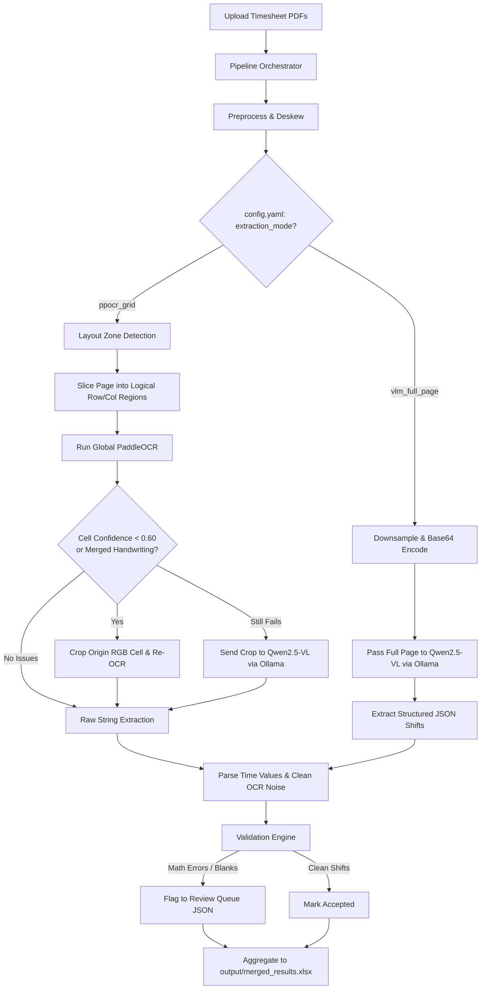

# Timesheet OCR

<div align="center">
  <h3>A fully local, privacy-first pipeline to extract, validate, and structure data from scanned handwritten home-health timesheets.</h3>
</div>

<br/>

Designed to convert messy, handwritten PDF uploads into ultra-clean Excel databases while strictly flagging calculation errors or missed signatures.

---

## 🚀 Key Features

- **100% Local Inference**: Eliminates PHI/HIPAA compliance risks. Everything runs locally on Apple Silicon (or standard GPUs) using `paddleocr` and `ollama` (Qwen2.5-VL), ensuring patient data never leaves the machine.
- **Dual Extraction Modes**: 
  - **`ppocr_grid`**: High-speed deterministic grid slicing utilizing PaddleOCR for standard tabular forms. Includes a smart fallbacks mechanism that re-crops faint handwriting cells using original color imagery to enhance character recovery.
  - **`vlm_full_page`**: Deep contextual Vision-LLM extraction using Qwen2.5-VL for deeply cursive, messy, or bespoke non-standard timesheets.
- **Aggressive OCR Parser**: The parsing engine is highly tuned to automatically correct common PPOCR model hallucinations (e.g., automatically resolving `"Q:00PM"` to `2:00 PM` or `"8.00.0M"` to `8:00 AM`).
- **Robust Validation Engine**: Automatically calculates written "Total Hours" against parsed Time-In/Time-Out math, flags >16 hour shifts, and catches unparseable fields or missing names.
- **Smart Queueing & Appending**: The orchestrator continuously scans the `input/` folder, skipping files that have already been mapped, appending new shifts directly into a centralized `merged_results.xlsx`.

---

## 🧠 System Architecture

The pipeline seamlessly ingests raw scanned PDFs and dynamically routes them through one of the two dedicated extraction engines, rigorously validating output before dumping the records into an actionable billing or payroll queue.



---

## 🔧 Two Extraction Modes

The system was explicitly designed to handle multiple varieties of home-health forms through `config.yaml`. *(See the `workflows/` directory for detailed documentation on internal module logic for these modes).*

### 1. The `vlm_full_page` Mode (Deep Contextual OCR)
**Best for**: "Matrix" style timesheets, heavily cursive documents, or forms that do not strictly adhere to standard box boundaries.

In this mode, the parameters inside the `config.yaml` layout section are completely ignored. The entire preprocessed page is passed to `qwen2.5vl:7b`. The model uses deep spatial reasoning to natively map distinct columns like 'Time In' and 'Total Hours' together, aggressively excluding hallucinated or blank fields based on prompt logic.

*Pros*: Extremely robust against messy layouts and overlapping handwriting.
*Cons*: Compute intensive; slower processing (~60-90 seconds per page).

### 2. The `ppocr_grid` Mode (High-Speed Structured OCR)
**Best for**: Standardized agency timesheets with distinct, uniform rectangular grid boundaries (e.g. "Skilled Record" templates).

In this mode, the pipeline deterministically slices the image into rows and columns using rigid coordinate mappings measured dynamically against the dimensions of the paper. It extracts text with `paddleocr`. If PaddleOCR struggles to read a messy cell natively, the pipeline dynamically crops the target area from the *original color image* (saving ink-pressure cues lost during standard binarization) and tries again.

*Pros*: Blazing fast (~10-20 seconds per page).
*Cons*: Relies heavily on accurate alignment mapping in `config.yaml`.

---

## 📐 Adding Support for New Timesheet Templates

By default, the `ppocr_grid` extracts coordinates based on the active constraints defined inside `config.yaml`. If you acquire timesheets from a brand new agency where the "Time In" or "Date" columns are slightly shifted, you **must update the layout fractions**.

To remap for a new template:
1. Provide a blank or sample PDF of the new timesheet.
2. Run `debug_layout.py` on the sample. The pipeline will overlay grid boundaries on top of the physical PDF image and output visual files into the `output/` folder.
3. Open the output debug image, and adjust the fractional `X, Y` coordinate boundaries in `config.yaml` to precisely encapsulate the target columns (e.g., ensuring `time_in:` perfectly boxes the "TIME IN" header and raw data).

```yaml
# Inside config.yaml -> layout -> columns
# Example of shifting the 'TIME IN' block from 86.5% of the page down to 89.5%
columns:
  time_in: [0.865, 0.895] 
  time_out: [0.895, 0.915]
```

> [!WARNING]
> Remember: the `table_zone` must entirely encompass your defined `columns` ranges. If the label row throws off grid mapping, use `table_zone: [0.24, 0.16, 1.0, 0.95]` to adjust the `X-start` boundary, effectively skipping left-side column labels.

---

## 💻 Quick Start & Deployment

### 1. Prerequisites
- [uv](https://docs.astral.sh/uv/) for Python dependency management.
- [Ollama](https://ollama.com/) running locally.
- Install the Vision model: `ollama run qwen2.5vl:7b` *(Ensure the tag exactly matches `config.yaml`)*

### 2. Run the Pipeline
Simply drop any PDFs or standard images into the `input/` folder and execute the overarching orchestrator:

```bash
uv run timesheet-ocr --verbose
```

The pipeline will detect which files are new, process them sequentially, and construct outputs natively.

### 3. Understanding Outputs
Data gets continuously funneled into the `output/` directory:
*   `merged_results.xlsx` — The consolidated "source of truth", formatting every processed shift (accepted and flagged) across all runs.
*   `[file]_report.json` — A technical audit log capturing start times, page success counts, and extraction validations.
*   `[file]_review.json` — A vital queue uniquely isolating every single row that was flagged due to mismatched calculation math, unrecognizable fields, or missing signatures, accelerating human intervention!