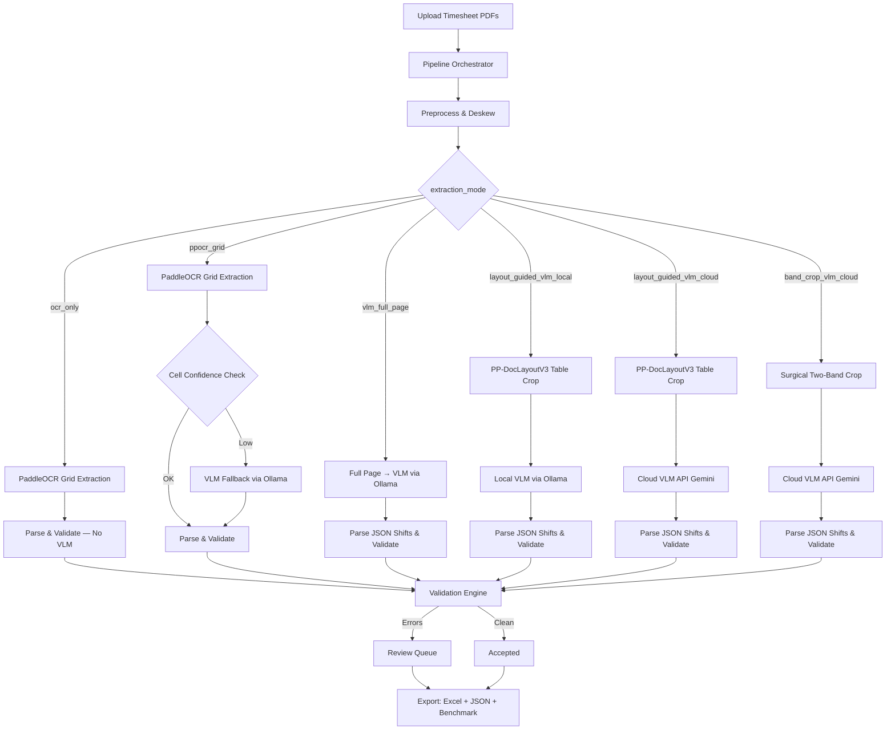

# Timesheet OCR

<div align="center">
  <h3>A privacy-first pipeline to extract, validate, and structure data from scanned handwritten home-health timesheets using 6 distinct approaches.</h3>
</div>

<br/>

Designed to convert messy, handwritten PDF uploads into structured, validated Excel databases while benchmarking extraction quality across OCR-only, hybrid, and full VLM approaches.

---

## 🧠 System Architecture



---

## 🔬 6 Extraction Approaches

| # | Approach | Mode | Description | Speed | Best For |
|---|----------|------|-------------|-------|----------|
| 1 | **OCR Only** | `ocr_only` | PaddleOCR grid extraction with zero VLM involvement. Empty cells stay empty. | ⚡⚡⚡ Fastest | Baseline comparison, printed forms |
| 2 | **OCR + VLM Fallback** | `ppocr_grid` | PaddleOCR grid extraction with per-cell VLM fallback on low confidence. | ⚡⚡ Fast | Standardized forms, privacy-first |
| 3 | **VLM Full Page** | `vlm_full_page` | Entire page sent to local VLM for structured JSON extraction. | ⚡ Slow | Messy layouts, cursive handwriting |
| 4 | **Layout-Guided VLM (Local)** | `layout_guided_vlm_local` | PP-DocLayoutV3 detects table zone, crops it, sends to local VLM. | ⚡ Slow | Balance of accuracy + privacy |
| 5 | **Layout-Guided VLM (Cloud)** | `layout_guided_vlm_cloud` | PP-DocLayoutV3 detects table zone, crops it, sends to cloud VLM (Gemini). | ⚡⚡ Moderate | Maximum accuracy, API available |
| 6 | **Band-Crop VLM (Cloud)** | `band_crop_vlm_cloud` | PP-DocLayoutV3 detects table, then surgical two-band crop (DATE row + footer block) — only billing fields transmitted to Gemini. Zero clinical PHI sent to cloud. | ⚡⚡ Moderate | Maximum accuracy + strongest PHI compliance |

### Workflow Diagrams

Detailed Mermaid diagrams for each approach are in the [`workflows/`](workflows/) directory:

- [`workflows/ocr_only_flow.md`](workflows/ocr_only_flow.md)
- [`workflows/ppocr_grid_flow.md`](workflows/ppocr_grid_flow.md)
- [`workflows/vlm_full_page_flow.md`](workflows/vlm_full_page_flow.md)
- [`workflows/layout_guided_vlm_local_flow.md`](workflows/layout_guided_vlm_local_flow.md)
- [`workflows/layout_guided_vlm_cloud_flow.md`](workflows/layout_guided_vlm_cloud_flow.md)
- [`workflows/band_crop_vlm_cloud_flow.md`](workflows/band_crop_vlm_cloud_flow.md)
- [`workflows/ground_truth_comparison.md`](workflows/ground_truth_comparison.md) — Ground truth comparison workflow

---

## 📊 Benchmark Results

Results from processing **Sample Timesheets** (2 pages, 7 expected shifts):

| Metric | OCR Only | OCR + VLM Fallback | VLM Full Page | Layout-Guided VLM (Local) | Layout-Guided VLM (Cloud) | Band-Crop VLM (Cloud) |
|--------|----------|-------------------|---------------|--------------------------|--------------------------|----------------------|
| **Processing Time (s)** | 100.24 | 195.11 | 1011 | 818.95 | 145.85 | 48.98 |
| **Rows Extracted** | 16 | 24 | 19 | 20 | 18 | 18 |
| **Accepted Rows** | 2 | 3 | 13 | 13 | **16** | 12 |
| **Flagged Rows** | 14 | 21 | 6 | 7 | 2 | 6 |
| **Mean Confidence** | 0.604 | 0.724 | **0.900** | **0.900** | **0.900** | **0.900** |
| **VLM Fallbacks** | **0** | 0 | 0 | 0 | 0 | 0 |
| **Hours Mismatch Rate** | **0.0%** | **0.0%** | 50.0% | 83.3% | **0.0%** | 33.3% |
| **Field Missing Rate** | 66.7% | 72.7% | **0.0%** | **0.0%** | **0.0%** | 50.0% |
| **Mean CER** | 0.899 | 0.899 | 0.615 | 0.615 | 0.594 | 0.594 |

### Key Findings

- **Layout-Guided VLM (Cloud)** achieves the best accuracy: 16 accepted, 0% hours mismatch, 0% field missing, lowest CER
- **Band-Crop VLM (Cloud)** is the fastest approach (48.98s — 3× faster than layout-guided cloud), zero clinical PHI transmitted, ~15% of page pixels sent to Gemini
- **OCR Only** extracts 16 rows but only accepts 2 — handwritten text requires VLM
- **OCR + VLM Fallback** extracts the most rows (24) but only accepts 3 due to low OCR confidence
- **VLM Full Page** and **Layout-Guided VLM (Local)** are slowest due to local model inference
- **Band-Crop** trades precision for privacy: 33.3% hours mismatch vs 0% for layout-guided cloud, but sends 85% less data to Gemini

---

## 📏 Ground Truth Comparison & Extraction Accuracy

The pipeline includes a ground truth comparison workflow that evaluates extraction accuracy against manually-annotated reference data:

### How It Works

1. **Fill in ground truth**: Manually enter expected values in `ground_truth.xlsx` (project root)
   - Columns: `source_file`, `date`, `total_hours`, `time_in`, `time_out`, `employee_name`
2. **Run all 6 approaches**: Use `scripts/run_all_approaches_safe.py` to generate benchmark data
3. **Automatic**: Combined metrics and ground truth comparison are generated automatically after all approaches complete:
   - `output/combined/benchmark_combined.xlsx` — approach comparison + Human-Verified Results + Time Comparison
   - `output/combined/consensus.xlsx` — KPI dashboard + per-row best-approach detail

### Metrics Computed

The comparison script computes two categories of metrics:

#### 1. Field-Level Accuracy

Each extracted row is evaluated against ground truth on a per-field basis:

| Field | Tolerance | Definition |
|-------|-----------|------------|
| **Date** | Exact match | Parsed date must equal ground truth date |
| **Hours** | ±0.25 hours (15 min) | Computed or extracted hours within tolerance |
| **Time In** | ±30 minutes | Clock-in time within tolerance |
| **Time Out** | ±30 minutes | Clock-out time within tolerance |

**Composite metrics:**
- **Fully Correct**: All 3 time/hour fields match
- **Partial or Full Match**: At least one field matches
- **Not Extracted**: No matching row found in the approach's output

#### 2. Pipeline Validation Quality

Measures how well the pipeline's *internal* validation status (accepted/flagged/failed) correlates with *actual* correctness:

| Metric | Definition | Ideal |
|--------|------------|-------|
| **Validation Precision** | Of rows marked "accepted", % that are fully correct | 100% |
| **Validation Recall** | Of all fully correct rows, % that were accepted | 100% |
| **Validation F1** | Harmonic mean of precision and recall | 1.000 |
| **False Accept Rate** | Of accepted rows, % that are actually wrong | 0% |
| **Missed Detection Rate** | Of correct rows, % that were flagged/failed | 0% |

### Output

Results are written to the `Human-Verified Results` sheet in `output/combined/benchmark_combined.xlsx` with these sections:

- **Section 1**: Extraction Coverage & Field-Level Accuracy (per-field rates, duplicate/hallucinated row counts, fully correct counts)
- **Section 2**: Pipeline Validation Quality (precision, recall, false accept rate)
- **Section 3**: Per-Row Detailed Comparison (side-by-side hours, correctness checkmarks, and status for all 5 approaches)
- **Section 4**: Duplicate Rows (approach extracted same date but not best match — source timesheet had duplicates)
- **Section 5**: Extra Rows (approach extracted dates not in ground truth — true hallucinations)

---

## 💻 Quick Start

### Prerequisites

- [uv](https://docs.astral.sh/uv/) for Python dependency management
- [Ollama](https://ollama.com/) running locally (for local VLM modes)
- Google API key (for cloud VLM mode)

```bash
# Install dependencies
uv sync

# Pull the local VLM model (required for ppocr_grid, vlm_full_page, layout_guided_vlm_local)
ollama pull qwen2.5vl:7b

# Set up environment variables (for cloud VLM mode)
cp .env.example .env
# Edit .env and add your API keys
```

### Run the Pipeline

```bash
# Place PDFs/images in input/
# Set extraction_mode in config.yaml
uv run timesheet-ocr --verbose
```

### Run All 6 Approaches for Benchmarking

```bash
# Run all 6 approaches (uses config.yaml extraction_mode internally)
uv run python scripts/run_all_approaches_safe.py

# If interrupted, resume from last completed approach:
uv run python scripts/run_all_approaches_safe.py --resume

# Output: output/combined/benchmark_combined.xlsx + output/combined/consensus.xlsx

# Optional: Fill in ground_truth.xlsx with expected values for accuracy evaluation, then re-run:
# uv run python scripts/run_all_approaches_safe.py
```

---

## ⚙️ Configuration

Key settings in `config.yaml`:

```yaml
extraction_mode: "ppocr_grid"   # ocr_only | ppocr_grid | vlm_full_page | layout_guided_vlm_local | layout_guided_vlm_cloud | band_crop_vlm_cloud

confidence:
  accept_threshold: 0.90        # Accept OCR results above this confidence
  fallback_threshold: 0.75      # Below this, flag for review

layout:
  transposed: true              # Timesheet has dates as columns
  header_zone: [0.0, 0.0, 1.0, 0.16]
  table_zone: [0.24, 0.16, 1.0, 0.98]

ollama:
  model: "qwen2.5vl:7b"         # Local VLM model
  timeout_seconds: 60

cloud_vlm:
  provider: "google"
  model: "gemini-3-flash-preview"
```

---

## 📁 Output Structure

```
output/
├── ocr_only/                    # Approach 1 results
│   ├── benchmark_patient_a_week1.xlsx
│   ├── merged_results.xlsx
│   └── patient_a_week1_report.json
├── ppocr_grid/                  # Approach 2 results
├── vlm_full_page/               # Approach 3 results
├── layout_guided_vlm_local/     # Approach 4 results
├── layout_guided_vlm_cloud/     # Approach 5 results
├── band_crop_vlm_cloud/         # Approach 6 results
├── combined/                    # Combined benchmark across all approaches
│   ├── benchmark_combined.xlsx  # Summary + row-level + Human-Verified Results + Time Comparison
│   ├── consensus.xlsx           # KPI dashboard + per-row best-approach detail
│   └── debug/                   # Debug images from all approaches
└── debug/                       # Shared debug images

ground_truth.xlsx                # Manually-filled reference data (git-ignored, at project root)
```

Each approach directory contains:
- `benchmark_*.xlsx` — Per-run benchmark with Run Summary, Page Details, and Row-Level sheets
- `merged_results.xlsx` — Consolidated extraction results
- `*_report.json` — Technical audit log
- `*_review.json` — Flagged rows for human review

The `benchmark_combined.xlsx` file contains:
- **Approach Comparison** — Summary metrics + row-level comparison across all approaches
- **Human-Verified Results** — Ground truth comparison with 3 sections:
  - Extraction Coverage & Field-Level Accuracy (Date, Hours, Time In/Out rates, plus duplicate and hallucinated row counts)
  - Pipeline Validation Quality (precision, recall, false accept rate)
  - Per-Row Detailed Comparison (side-by-side values with ✓/✗ checkmarks)
- **Time Comparison** — Three tables: Time-In comparison, Time-Out comparison, and Correctness Summary

The `consensus.xlsx` file contains:
- **KPI Dashboard** — Per-approach accuracy (Hours ±0.25h, Time-In ±30min, Time-Out ±30min) plus "Best of 6" accuracy and approach win counts
- **Per-Row Detail** — For each ground truth row, which approach had the closest hours and all 6 approaches' values side-by-side

---

## 🔒 PHI/PII Anonymization

The pipeline includes automatic PHI anonymization for benchmarking:

- **Patient names** → `Patient_A`, `Patient_B`, `Patient_C` (deterministic, sorted by filename)
- **Employee names** → `Employee_A`, `Employee_B`, etc.
- **Filenames** → `patient_a_week1.pdf`, etc.
- **Signature pages** — Detected and skipped (no row extraction, no visualization)

All benchmark outputs use anonymized names. Original data remains in `output/{approach}/` directories.

---

## 📐 Adding Support for New Timesheet Templates

1. Place a sample PDF in `input/`
2. Enable debug visualization in `config.yaml`:
   ```yaml
   debug:
     visualize_ocr: true
   ```
3. Run the pipeline and inspect debug images in `output/debug/`
4. Adjust `layout:` zone fractions in `config.yaml` to match the new template's structure
5. Verify extraction quality and iterate

---

## 📋 Monitoring & Logs

All batch runs write logs to the `logs/` directory:

| File | Contents | When to Use |
|------|----------|-------------|
| `logs/batch_run_YYYYMMDD_HHMMSS.log` | Full detailed log of every page, file, and approach | Post-run debugging |
| `logs/latest.log` | Symlink that always points to the most recent log | Live monitoring during a run |

### Watch a Live Run

```bash
tail -f logs/latest.log
```

### Check for Errors After a Run

```bash
grep -E "ERROR|FAILED" logs/latest.log
```

### Run State File

After every completed approach, the script writes progress to `output/.run_state.json`. This file tracks which approaches are fully done. If the machine shuts down mid-run, use `--resume` to pick up from the last completed approach:

```bash
uv run python scripts/run_all_approaches_safe.py --resume
```

> **Note:** Resume is per-approach, not per-file. If a run is interrupted mid-approach, that approach will restart from its first file.

### Per-File Status

At the end of each approach run, the terminal prints a per-file summary showing `✓` (success) or `✗` (failed) for every input file. The same information is written to `reports/report_YYYYMMDD_HHMMSS.txt` for a persistent audit trail.

---

## 📝 Changelog

See [CHANGELOG.md](CHANGELOG.md) for version history.

---

## 📄 License

MIT License — see [LICENSE](LICENSE) for details.
