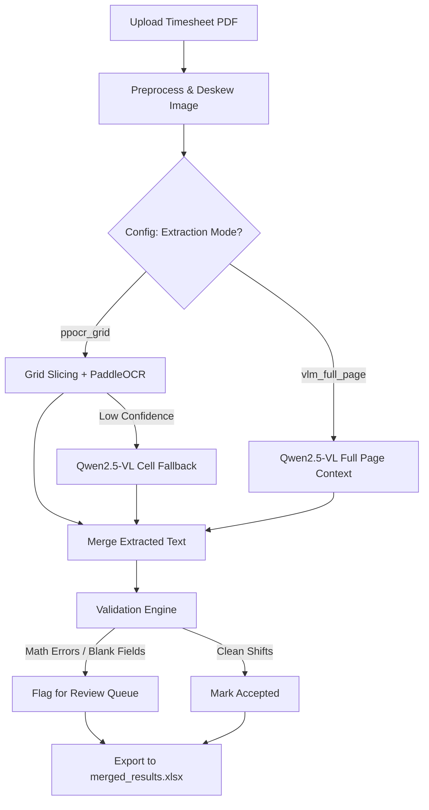

# Timesheet OCR

A fully local, privacy-first pipeline to extract, validate, and structure data from scanned handwritten home-health timesheets. 

Designed to convert messy, handwritten PDF uploads into ultra-clean Excel databases while strictly flagging calculation errors or missed signatures.

---

## 🚀 Features

- **100% Local Inference**: Eliminates PHI/HIPAA risks. Runs locally on Apple Silicon (or standard GPUs) using `paddleocr` and `ollama` (Qwen2.5-VL).
- **Dual Extraction Modes**: Seamlessly toggle between high-speed grid processing (`ppocr_grid`) for standard forms, and deep contextual Vision-LLM extraction (`vlm_full_page`) for messy bespoke timesheets.
- **Robust Validation Engine**: Automatically flags shifts with missing times, calculates written "Total Hours" against Time-In/Time-Out math, and verifies dates.
- **Smart Appending**: Continuously appends new timesheet passes into a central `merged_results.xlsx` file. Skips files it has already ingested!

---

## 🧠 Architecture Overview

At exactly a high level, the pipeline ingests scanned PDFs, dynamically routes them through one of the two AI engines based on configuration, validates the logic of every shift, and dumps actionable data for billing or payroll into a consolidated Excel document.



---

## 🔧 Two Extraction Modes

The system was explicitly designed to handle multiple varieties of home-health forms through `config.yaml`.

### 1. The `vlm_full_page` Mode (Deep Contextual OCR)
**Best for**: "Matrix" style timesheets, heavily cursive documents, or forms that do not strictly adhere to standard box boundaries.

In this mode, the entire preprocessed page is passed to `qwen2.5-vl:7b`. The model uses deep spatial reasoning to natively map distinct columns like 'Time In' and 'Total Hours' together, aggressively excluding hallucinated or blank fields. 

*Pros*: Extremely robust against messy layouts and signature pages.
*Cons*: Slower processing (~60 seconds per page).

### 2. The `ppocr_grid` Mode (High-Speed Structured OCR)
**Best for**: Standardized agency timesheets with distinct, uniform rectangular grid boundaries. 

In this mode, the pipeline deterministically slices the image into rows and columns using rigid coordinate mappings. It extracts text with `paddleocr`. If PaddleOCR struggles to read a messy cell (e.g., confidence < `0.60`), the system dynamically sends *only that tiny cropped cell* to `qwen2.5-vl:7b` for a highly isolated re-extraction.

*Pros*: Blazing fast (~20 seconds per page).
*Cons*: Relies heavily on perfect alignment and strict templates.

---

## 💻 Quick Start

### 1. Prerequisites
- [uv](https://docs.astral.sh/uv/) for Python dependency management.
- [Ollama](https://ollama.com/) running locally.
- Install the Vision model: `ollama run qwen2.5-vl:7b`

### 2. Run the Pipeline
Simply drop any PDFs or standard images into the `input/` folder and execute:

```bash
uv run timesheet-ocr --verbose
```

The pipeline will detect which files are new, process them sequentially based on `config.yaml`, and append the results into `output/merged_results.xlsx`. You can also target a single file using the `--file` flag!

---

## ⚙️ Configuration & Output

Modify `config.yaml` to adjust the Extraction Mode, Validation thresholds, Column boundaries (for the PPOCR method), and Fallback triggers.

**Outputs generated in `output/`:**
*   `merged_results.xlsx` — The consolidated spreadsheet of all processed shifts.
*   `[file]_report.json` — A technical log of processing time and validation hits.
*   `[file]_review.json` — A queue isolating every single flagged row that needs manual human intervention.