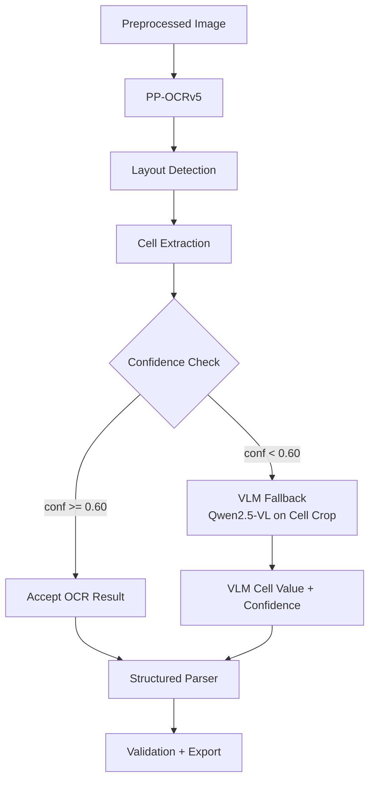
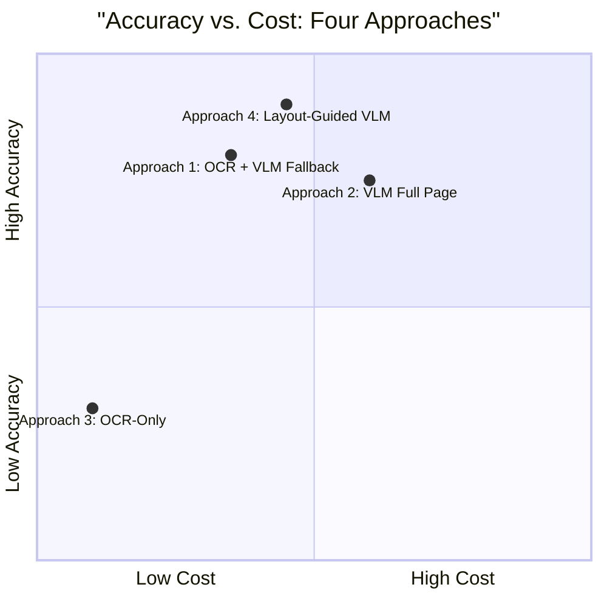

# Four Approaches to Handwritten Timesheet OCR: A Comparative Analysis

## Abstract

Home-health timesheets present unique OCR challenges: handwritten in cursive, structured in tabular grids, and containing PHI (Protected Health Information). This document describes four distinct extraction approaches spanning a spectrum from traditional OCR to Vision-Language Models (VLMs), with a focus on accuracy, cost, latency, and scalability.

---

## 1. System Architecture Overview

```mermaid
graph TB
    subgraph Input
        PDF[PDF / Image Timesheets]
    end

    subgraph Preprocessing
        PRE[Preprocessing Pipeline<br/>Denoise | Deskew | Binarize<br/>Target: 300 DPI]
    end

    subgraph "Approach 3: OCR-Only"
        A1[PP-OCRv5 Mobile<br/>Detection + Recognition]
        A2[Rule-Based Layout<br/>Morphological Ops]
        A3[Structured Parser<br/>Date | Time | Hours]
        A1 --> A2 --> A3
    end

    subgraph "Approach 1: OCR + VLM Fallback"
        B1[PP-OCRv5 Mobile<br/>Detection + Recognition]
        B2[Rule-Based Layout<br/>Morphological Ops]
        B3[Confidence Router<br/>Threshold-based]
        B4[VLM Per-Cell<br/>Qwen2.5-VL via Ollama]
        B5[Structured Parser<br/>Date | Time | Hours]
        B1 --> B2 --> B3
        B3 -->|conf >= 0.60| B5
        B3 -->|conf < 0.60| B4 --> B5
    end

    subgraph "Approach 4: Layout-Guided VLM"
        C1[PP-DocLayoutV3<br/>Table Detection]
        C2[Crop Table Region]
        C3[VLM Full Extraction<br/>Qwen2.5-VL via Ollama]
        C4[Structured Parser<br/>Date | Time | Hours]
        C1 --> C2 --> C3 --> C4
    end

    subgraph "Approach 2: VLM Full Page"
        D1[VLM Full Page<br/>Qwen2.5-VL via Ollama]
        D2[Structured Parser<br/>Date | Time | Hours]
        D1 --> D2
    end

    subgraph Output
        E1[Validation Engine<br/>Duplicates | Overlaps | 24h Limit]
        E2[Export<br/>XLSX | CSV | JSON]
        E3[Benchmark<br/>Per-File | Per-Row | CER]
    end

    PDF --> PRE
    PRE --> A1
    PRE --> B1
    PRE --> C1
    PRE --> D1
    A3 --> E1
    B5 --> E1
    C4 --> E1
    D2 --> E1
    E1 --> E2
    E1 --> E3
```

---

## 2. The Four Approaches

### Approach 3: OCR-Only (PP-OCRv5)

**Concept:** Pure traditional OCR pipeline with no LLM involvement. PP-OCRv5 Mobile performs text detection and recognition on the full preprocessed image. A rule-based layout detector uses morphological operations (horizontal/vertical line detection via OpenCV) to segment the timesheet grid into rows and columns. Field bands are identified by matching OCR text against known label keywords ("Date", "Time In", "Time Out", "Hours"). Each cell's text is parsed into structured fields.

```mermaid
flowchart LR
    A[Preprocessed Image] --> B[PP-OCRv5<br/>Text Detection + Recognition]
    B --> C[Morphological Layout<br/>Row/Column Boundaries]
    C --> D[Field Band Detection<br/>Label Keyword Matching]
    D --> E[Cell Text Extraction<br/>Per-Cell OCR]
    E --> F[Structured Parser<br/>Date | Time | Hours]
    F --> G[Validation + Export]
```

**Key Characteristics:**
- **Model:** PP-OCRv5_mobile_det + PP-OCRv5_mobile_rec (~10-15 MB combined)
- **Layout:** Rule-based morphological operations (OpenCV)
- **LLM Calls:** 0
- **Inference:** Fully local, no network dependency
- **Deterministic:** Same input always produces same output

**Strengths:**
- Zero inference cost after initial setup
- No network dependency — fully offline
- Fast inference (~1-3 seconds per page on CPU)
- Deterministic and reproducible
- No PHI leaves the local machine

**Weaknesses:**
- Struggles with handwritten cursive (PP-OCRv5 trained primarily on printed text)
- No semantic understanding — cannot infer context
- Sensitive to writing quality, ink bleed, and paper artifacts
- Cannot recover from OCR misreads without external signal

---

### Approach 1: OCR + VLM Fallback

**Concept:** Hybrid pipeline where PP-OCRv5 handles the primary extraction, but a confidence router selectively triggers VLM fallback for low-confidence cells. The VLM (Qwen2.5-VL via Ollama) re-extracts individual cropped cells when OCR confidence falls below a configurable threshold (default: 0.60). This approach provides the best of both worlds: speed and determinism from OCR, with the handwriting robustness of a VLM where it matters most.



**Key Characteristics:**
- **Primary Model:** PP-OCRv5 Mobile
- **Fallback Model:** Qwen2.5-VL (7B) or Qwen3-VL (8B) via Ollama
- **Fallback Trigger:** Per-cell confidence < 0.60
- **LLM Calls:** Selective (typically 10-40% of cells, depending on handwriting quality)
- **Granularity:** Cell-level (cropped individual cells sent to VLM)

**Strengths:**
- Dramatically reduces VLM API calls compared to full-page VLM
- Maintains OCR speed for high-confidence cells
- VLM handles the hard cases (handwriting, low contrast)
- Source tracking: every field tagged as PPOCR or VLM
- Cost-effective: only pays for what OCR cannot handle

**Weaknesses:**
- Still dependent on OCR for layout detection and cell segmentation
- VLM cell extraction lacks column context (sees only one cell)
- Two-model pipeline increases complexity
- Fallback threshold tuning required per dataset

---

### Approach 4: Layout-Guided VLM (Proposed)

**Concept:** A learned document layout model (PP-DocLayoutV3, ~few MB) first detects the table/grid region of the timesheet. The detected table region is cropped and sent as a single image to the VLM for full extraction. By removing headers, signatures, footers, and other non-table content, the VLM focuses exclusively on the structured grid with less visual noise and fewer hallucination opportunities.

```mermaid
flowchart LR
    A[Preprocessed Image] --> B[PP-DocLayoutV3<br/>Table Detection]
    B --> C[Crop Table Region]
    C --> D[VLM Full Extraction<br/>Qwen2.5-VL on Table Crop]
    D --> E[Structured Parser<br/>Date | Time | Hours]
    E --> F[Validation + Export]
```

**Detailed Flow:**

```mermaid
flowchart TD
    A[Full Page Image] --> B[PP-DocLayoutV3]
    B --> C{Table Detected?}
    C -->|Yes| D[Extract Bounding Box]
    C -->|No| E[Fallback: Full Page to VLM]
    D --> F[Crop Table Region]
    F --> G[Send Table Crop to VLM<br/>Prompt: Extract all shifts<br/>from this timesheet grid]
    G --> H[Parse JSON Response<br/>shifts: [{date, time_in,<br/>time_out, total_hours}]]
    H --> I[Anti-Hallucination Check<br/>Max 7 rows per page]
    I --> J[Structured Parser<br/>Date | Time | Hours<br/>+ AM/PM Disambiguation]
    J --> K[Validation + Export]
    E --> G
```

**Key Characteristics:**
- **Layout Model:** PP-DocLayoutV3 (~few MB, fast, learned detection)
- **Extraction Model:** Qwen2.5-VL (7B) or Qwen3-VL (8B) via Ollama
- **LLM Calls:** 1 per page (table crop)
- **Image Size:** Reduced (table region only, ~40-60% of full page)
- **Context:** VLM sees full table structure with column headers

**Strengths:**
- Removes visual noise (signatures, agency headers, patient info, footers)
- VLM sees column headers and row structure — better contextual understanding
- Smaller image = fewer tokens = faster inference + lower cost
- Fewer hallucination opportunities (no text outside the grid to confuse the model)
- PP-DocLayoutV3 is tiny and fast — negligible overhead
- Novel contribution: "layout-aware VLM extraction" as a defensible paper contribution
- Graceful fallback to full-page VLM if table detection fails

**Weaknesses:**
- PP-DocLayoutV3 trained on general documents — may need validation on timesheet forms
- Single point of failure: if table detection fails, falls back to full page
- Still requires VLM API/infrastructure (Ollama server)
- Not fully offline (depends on VLM availability)

---

### Approach 2: VLM Full Page

**Concept:** End-to-end extraction using only a Vision-Language Model. The entire preprocessed page image is sent to Qwen2.5-VL with a structured prompt requesting JSON output of all shifts, employee name, and patient name. No traditional OCR or layout detection is used. Anti-hallucination guards discard responses with more than 7 rows (typical timesheet week).

```mermaid
flowchart LR
    A[Preprocessed Image] --> B[VLM Full Page<br/>Qwen2.5-VL via Ollama<br/>Prompt: Extract all shifts]
    B --> C[Parse JSON Response<br/>shifts: [{date, time_in,<br/>time_out, total_hours}]]
    C --> D[Anti-Hallucination Check<br/>Max 7 rows per page]
    D --> E[Structured Parser<br/>Date | Time | Hours<br/>+ AM/PM Disambiguation]
    E --> F[Validation + Export]
```

**Key Characteristics:**
- **Model:** Qwen2.5-VL (7B) or Qwen3-VL (8B) via Ollama
- **LLM Calls:** 1 per page (full image)
- **No OCR:** Zero dependency on PaddleOCR
- **No Layout Detection:** VLM infers structure from the full image

**Strengths:**
- Simplest pipeline — single model, no orchestration
- No layout detection required
- VLM can handle diverse timesheet formats without reconfiguration
- Semantic understanding: VLM can distinguish employee name from agency name

**Weaknesses:**
- Full page includes visual noise (signatures, headers, footers, agency names)
- Higher hallucination risk — VLM may extract text from non-table regions
- Larger image = more tokens = slower inference + higher cost
- No fallback if VLM fails
- Sensitive to prompt engineering quality

---

## 3. Comparative Analysis

### 3.1 Architecture Comparison

| Dimension | Approach 3<br/>OCR-Only | Approach 1<br/>OCR + VLM Fallback | Approach 4<br/>Layout-Guided VLM | Approach 2<br/>VLM Full Page |
|-----------|------------------------|----------------------------------|----------------------------------|------------------------------|
| **Text Detection** | PP-OCRv5 | PP-OCRv5 | PP-DocLayoutV3 | None |
| **Text Recognition** | PP-OCRv5 | PP-OCRv5 + Qwen (selective) | Qwen (table crop) | Qwen (full page) |
| **Layout Detection** | Morphological (OpenCV) | Morphological (OpenCV) | PP-DocLayoutV3 (learned) | None (VLM infers) |
| **LLM Calls/Page** | 0 | 0.5-3 (selective cells) | 1 (table crop) | 1 (full page) |
| **Offline Capable** | Yes | Partial | No | No |
| **Deterministic** | Yes | Partial | No | No |
| **Model Size** | ~15 MB | ~15 MB + 7B VLM | ~few MB + 7B VLM | 7B VLM |

### 3.2 Expected Performance Characteristics

| Metric | Approach 3<br/>OCR-Only | Approach 1<br/>OCR + VLM Fallback | Approach 4<br/>Layout-Guided VLM | Approach 2<br/>VLM Full Page |
|--------|------------------------|----------------------------------|----------------------------------|------------------------------|
| **Field-Level Accuracy** | Low-Medium (handwriting) | High | High | Medium-High |
| **Date Accuracy** | Low (handwritten dates) | High | High | Medium-High |
| **Time Accuracy** | Low (AM/PM confusion) | High | High | Medium-High |
| **Hours Accuracy** | Medium (numeric, easier) | High | High | High |
| **Hallucination Rate** | N/A (no generation) | Low (cell-level context) | Low (table-only context) | Medium (full-page noise) |
| **Inference Time/Page** | 1-3s (CPU) | 3-10s (CPU + selective VLM) | 5-15s (VLM on crop) | 8-20s (VLM on full page) |
| **Cost/Page** | $0 | $0.01-0.05 (selective VLM) | $0.02-0.04 (1 VLM call) | $0.03-0.06 (1 VLM call) |
| **PHI Exposure** | None (fully local) | Partial (cell crops to VLM) | Partial (table crop to VLM) | Full (entire page to VLM) |

### 3.3 PHI Protection Comparison

| Aspect | Approach 3 | Approach 1 | Approach 4 | Approach 2 |
|--------|-----------|-----------|-----------|-----------|
| **Patient Name Sent to VLM** | Never | Never | No (cropped out) | Yes (full page) |
| **Employee Name Sent to VLM** | Never | Never | No (cropped out) | Yes (full page) |
| **Signatures Sent to VLM** | Never | Never | No (cropped out) | Yes (full page) |
| **Agency Name Sent to VLM** | Never | Never | No (cropped out) | Yes (full page) |
| **Shift Data Sent to VLM** | Never | Only low-confidence cells | Table crop only | Full page |

### 3.4 Accuracy-Cost Tradeoff



### 3.5 Decision Matrix

| Use Case | Recommended Approach | Rationale |
|----------|---------------------|-----------|
| High volume, low budget, printed forms | Approach 3 | Zero cost, fast, deterministic |
| Mixed print/handwriting, budget-conscious | Approach 1 | Best cost/accuracy tradeoff |
| Handwritten forms, PHI-sensitive | Approach 4 | High accuracy, minimal PHI exposure |
| Rapid prototyping, diverse formats | Approach 2 | Simplest pipeline, format-agnostic |
| Production deployment at scale | Approach 1 or 4 | Depends on PHI requirements |

---

## 4. Benchmark Infrastructure

The system includes a comprehensive benchmark framework that tracks:

### 4.1 Per-Run Metrics
- Total processing time, average page time
- Total rows extracted, accepted/flagged/failed counts
- Mean/min/max confidence scores
- VLM fallbacks triggered
- Hours mismatch rate (calculated vs. written)
- Field missing rate
- Mean Character Error Rate (CER) via Levenshtein distance

### 4.2 Per-Page Metrics
- Image dimensions, DPI
- Per-phase timing: OCR init, OCR inference, layout detection, VLM inference, extraction, validation
- Total boxes detected, rows extracted, empty rows skipped
- VLM fallback count

### 4.3 Per-Row Metrics
- Raw OCR text vs. parsed values for all 4 fields (date, time_in, time_out, total_hours)
- Per-field confidence and source (PPOCR, VLM, GENERATED)
- Calculated hours, overnight flag, validation status
- Corrections applied (raw → parsed transformations)

### 4.4 Combined Benchmark Export
Side-by-side comparison table with per-file results across all approaches, enabling direct statistical comparison for the IEEE paper.

---

## 5. Key Technical Innovations

### 5.1 AM/PM Disambiguation
When the VLM returns times without period markers (e.g., "8:00" and "4:30"), the system uses the written `total_hours` field to resolve ambiguity by trying all AM/PM combinations and selecting the one whose calculated hours best matches the written total.

### 5.2 Anti-Hallucination Hammer
VLM responses with more than 7 rows are discarded entirely, as a standard timesheet week contains at most 7 daily entries.

### 5.3 Confidence Router
Per-cell confidence scores from PP-OCRv5 are compared against a configurable threshold. Cells below the threshold trigger VLM fallback, while high-confidence cells bypass the VLM entirely.

### 5.4 Source Tracking
Every extracted field is tagged with its source (PPOCR, VLM, GENERATED, MANUAL), enabling precise attribution and audit trails.

### 5.5 Layout-Guided Cropping (Proposed)
Using PP-DocLayoutV3 to detect and crop the table region before VLM extraction reduces visual noise, minimizes hallucination risk, and decreases token count — a novel contribution for document understanding research.
