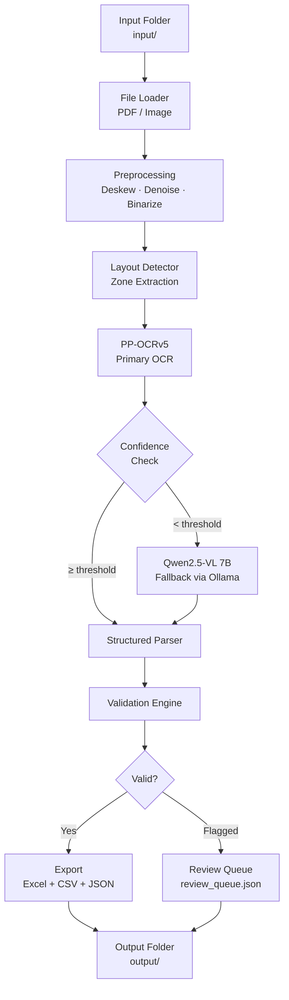

# Timesheet OCR — Local Extraction Pipeline

## Problem Statement

Home-health agencies receive scanned handwritten timesheets with a mostly-fixed layout. Office staff manually re-key extracted data into EVV (Electronic Visit Verification) systems — a slow, error-prone process. This project automates structured data extraction from those scans using a **fully local** pipeline.

---

## Resolved Open Questions

| Question | Decision |
|---|---|
| Sample timesheet | ✅ Real PDFs available in `input/` (3 multi-page timesheet PDFs) |
| Overnight shifts | ✅ Supported — Time In > Time Out interpreted as overnight (cross-midnight) |
| Multiple patients per sheet | Single patient per sheet (patient name in header) |
| Output format | CSV + JSON + **Excel (.xlsx)** via `openpyxl` |

---

## Architecture Overview

---

## Phased Execution Plan

### Phase 1 — Project Scaffolding & Dependencies
**Milestone:** `uv sync` works, all imports resolve.

- Initialize uv project (`pyproject.toml`)
- Add runtime deps: `paddleocr`, `paddlepaddle`, `ollama`, `Pillow`, `opencv-python-headless`, `pydantic`, `openpyxl`, `PyYAML`, `pdf2image`
- Add dev deps: `pytest`, `ruff`
- Create `src/timesheet_ocr/` package structure
- Create `config.yaml`, `output/`, `samples/` directories

### Phase 2 — Data Models, Config & Preprocessing
**Milestone:** Can load a PDF/image, preprocess it, return clean images ready for OCR.

- Pydantic models: `TimesheetRecord`, `TimesheetRow`, `ReviewItem`, `ExtractionResult`
- Config schema with confidence thresholds (accept: 0.85, fallback: 0.60)
- Image preprocessing: grayscale → adaptive threshold → deskew → denoise
- PDF-to-image conversion with `pdf2image`

### Phase 3 — PP-OCRv5 Engine & Layout Detection
**Milestone:** Extract raw text + bounding boxes + confidence from timesheet images.

- PP-OCRv5 wrapper (initialize once, run per-image)
- Zone-based layout config (header, table body, footer)
- Grid row detection via horizontal line detection
- Cell-to-field mapping by x-coordinate ranges
- Confidence aggregation (per-cell = min of text boxes)

### Phase 4 — Qwen2.5-VL Fallback & Confidence Router
**Milestone:** Low-confidence cells re-extracted via Qwen2.5-VL.

- Ollama client wrapper with timeout/error handling
- Cell-level and row-level fallback prompts
- Confidence router: accept → PP-OCRv5, fallback → Qwen, review → queue

### Phase 5 — Structured Parsing, Validation & Review Queue
**Milestone:** Raw OCR → validated records with flagged issues.

- Parser: raw text → typed fields (dates, times, durations)
- Overnight shift support (Time In > Time Out = cross-midnight)
- Validation rules: date/time parsing, hours cross-check, required fields, duplicates
- Review queue builder with reason codes

### Phase 6 — Export, CLI & Documentation
**Milestone:** End-to-end pipeline from CLI → Excel + CSV + JSON + review queue.

- Excel exporter via `openpyxl` (formatted, office-staff-friendly)
- CSV + JSON exporters
- CLI entry point: `uv run python -m timesheet_ocr`
- README documentation

---

## Verification Plan

### Automated Tests
- `uv run pytest tests/ -v`
- Unit tests for models, validation, parsing, confidence routing

### Manual Verification
- End-to-end run with real PDFs from `input/`
- Inspect Excel, CSV, JSON, review queue outputs
