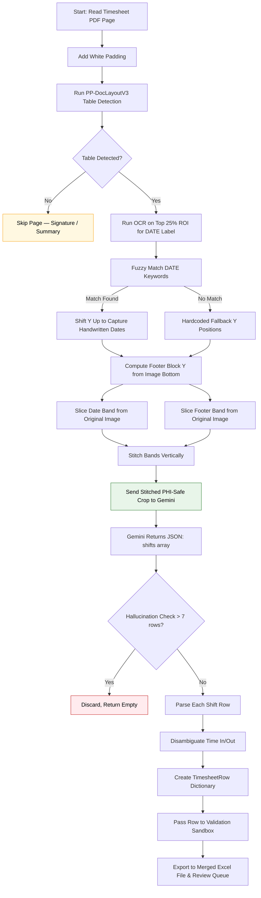

# Band-Crop VLM (Cloud) Flow (`band_crop_vlm_cloud`)

This workflow dictates the exact execution pipeline when `extraction_mode` inside `config.yaml` is set to `band_crop_vlm_cloud`.

This approach uses **PP-DocLayoutV3** to detect the table region, then surgically extracts **only two narrow bands** per page: the DATE row header and the footer TIME IN / TIME OUT / HOURS block. The stitched bands (containing zero clinical PHI) are sent to a **cloud VLM API** (Google Gemini) for structured extraction.

## Architecture

## Key Characteristics

| Aspect | Behavior |
|--------|----------|
| OCR role | DATE row detection only (top 25% ROI) |
| Layout detection | PP-DocLayoutV3 — table presence used as page classifier |
| Band extraction | Fuzzy keyword match on DATE label → shift Y up; footer block from image bottom fractions |
| VLM model | Cloud API (default: Google Gemini `gemini-3-flash-preview`) |
| Input to VLM | Stitched image of DATE row band + footer band (~15% of full page) |
| PHI exposure | **Zero clinical PHI** — only billing field headers transmitted |
| Anti-hallucination | Discards results with > 7 rows |
| Speed | Moderate (cloud inference, minimal preprocessing) |
| Accuracy | High — focused bands provide clear context for Gemini |
| Best use | Maximum accuracy + strongest PHI compliance, API key available |

## How Band Extraction Works

### DATE Row Detection

1. Run lightweight PaddleOCR on top 25% of padded image
2. Fuzzy-match detected text against DATE keywords (e.g., `date (month/day/year)`, `month/day/year`)
3. If match found (score ≥ 0.45): shift the band **UP** by 1.5× the label height to capture handwritten date values above the printed label
4. If no match: fall back to hardcoded Y fractions (0.5% – 21% of padded height)

### Footer Block Detection

1. Compute Y coordinates from image bottom: 2% margin from bottom, 12% height upward
2. Both bands are horizontally clamped to the table bbox X coordinates detected by PP-DocLayoutV3

### Stitching

1. Both bands are vertically concatenated with white padding to equalize widths
2. Final stitched image is ~15% of a full table crop — dramatically reducing data sent to Gemini

## Configuration

- **`cloud_vlm.provider`** — Cloud provider (default: `google`)
- **`cloud_vlm.model`** — Cloud model name (default: `gemini-3-flash-preview`)
- **`cloud_vlm.api_key_env`** — Environment variable name for API key
- **`cloud_vlm.timeout_seconds`** — Max wait time per API call
- **`cloud_vlm.inter_file_delay`** — Seconds between files (rate limiting)
- **`GOOGLE_API_KEY`** — Must be set in `.env` or environment
- **Debug visualization** — Generates `band_crop_payload_page_{N}.jpg` in output/debug/
