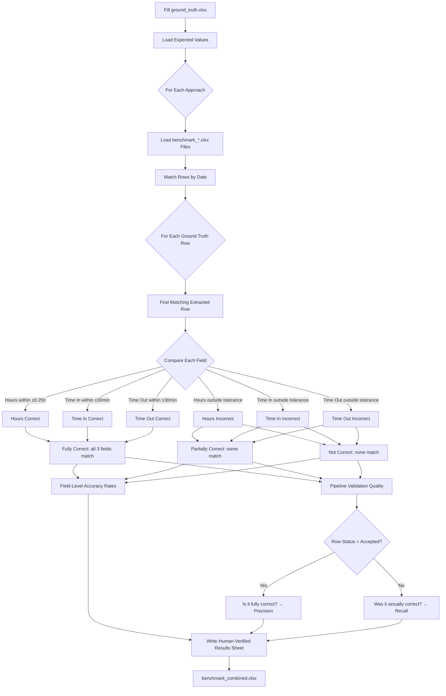

# Ground Truth Comparison Workflow

This workflow validates extraction accuracy by comparing pipeline outputs against manually-annotated ground truth data. It computes **field-level accuracy** (Date, Hours, Time In, Time Out) and **pipeline validation quality** (does the pipeline's internal "accepted" status correlate with actual correctness?) for each of the 5 extraction approaches.

## Architecture



## Step-by-Step Process

### 1. Prepare Ground Truth Data

Create `output/ground_truth.xlsx` with the following columns:

| Column | Description | Example |
|--------|-------------|---------|
| `source_file` | Original PDF filename | `<patient_1> Timesheets - 010726-011326.pdf` |
| `date` | Date of the shift | `1/7/26` |
| `total_hours` | Expected total hours worked | `8.0` |
| `time_in` | Expected clock-in time | `7:00 AM` |
| `time_out` | Expected clock-out time | `3:00 PM` |
| `employee_name` | Employee/caregiver name | `Jane Smith` |

### 2. Run All 5 Approaches

```bash
python scripts/run_all_approaches.py
```

This generates `benchmark_*.xlsx` files for each approach in their respective output directories.

### 3. Generate Combined Benchmark

```bash
python scripts/create_combined_results.py
```

This creates `output/combined/benchmark_combined.xlsx` with per-file results, page details, and row-level data.

### 4. Compare Against Ground Truth

```bash
uv run python scripts/compare_ground_truth.py
```

This adds a **Human-Verified Results** sheet to `benchmark_combined.xlsx`.

## Accuracy Metrics

### Field-Level Accuracy

Each extracted row is evaluated against ground truth on a per-field basis:

| Field | Tolerance | Definition |
|-------|-----------|------------|
| **Date** | Exact match | Parsed date must equal ground truth date |
| **Hours** | ±0.25 hours (15 min) | Computed or extracted hours within tolerance |
| **Time In** | ±30 minutes | Clock-in time within tolerance |
| **Time Out** | ±30 minutes | Clock-out time within tolerance |

**Composite metrics:**
- **Fully Correct**: All 3 time/hour fields match
- **Partial or Full Match**: At least one field matches
- **Not Extracted**: No matching row found in the approach's output

### Pipeline Validation Quality

The pipeline assigns each row a status: `accepted`, `flagged`, or `failed`. We measure how well this internal status correlates with actual correctness (vs ground truth):

| Metric | Definition | Ideal |
|--------|------------|-------|
| **Validation Precision** | Of rows marked "accepted", % that are fully correct | 100% |
| **Validation Recall** | Of all fully correct rows, % that were accepted | 100% |
| **Validation F1** | Harmonic mean of precision and recall | 1.000 |
| **False Accept Rate** | Of accepted rows, % that are actually wrong | 0% |
| **Missed Detection Rate** | Of correct rows, % that were flagged or failed | 0% |

## Output

The `Human-Verified Results` sheet in `benchmark_combined.xlsx` contains three sections:

### Section 1: Extraction Coverage & Field-Level Accuracy

| Metric | OCR Only | OCR + VLM Fallback | VLM Full Page | Layout-Guided (Local) | Layout-Guided (Cloud) |
|--------|----------|-------------------|---------------|----------------------|----------------------|
| Total Ground Truth Rows | 7 | 7 | 7 | 7 | 7 |
| Rows Extracted | 5 | 6 | 5 | 6 | 7 |
| Rows Not Extracted | 2 | 1 | 2 | 1 | 0 |
| Date Accuracy | 71.4% | 85.7% | 71.4% | 85.7% | 100.0% |
| Hours Accuracy (±0.25h) | 0.0% | 14.3% | 28.6% | 42.9% | 100.0% |
| Time In Accuracy (±30min) | 14.3% | 28.6% | 42.9% | 57.1% | 100.0% |
| Time Out Accuracy (±30min) | 14.3% | 28.6% | 42.9% | 57.1% | 100.0% |
| Fully Correct (all 3 fields) | 0 (0.0%) | 0 (0.0%) | 1 (14.3%) | 2 (28.6%) | 7 (100.0%) |
| Partial or Full Match | 1 (14.3%) | 2 (28.6%) | 3 (42.9%) | 4 (57.1%) | 7 (100.0%) |

### Section 2: Pipeline Validation Quality

| Metric | OCR Only | OCR + VLM Fallback | VLM Full Page | Layout-Guided (Local) | Layout-Guided (Cloud) |
|--------|----------|-------------------|---------------|----------------------|----------------------|
| Rows Marked 'Accepted' | 0 | 1 | 2 | 3 | 7 |
| Validation Precision | — | 0.0% | 50.0% | 66.7% | 100.0% |
| Validation Recall | — | 0.0% | 100.0% | 100.0% | 100.0% |
| Validation F1 | — | 0.000 | 0.667 | 0.800 | 1.000 |
| False Accept Rate | — | — | 50.0% | 33.3% | 0.0% |
| Missed Detection Rate | — | — | 0.0% | 0.0% | 0.0% |

### Section 3: Per-Row Detailed Comparison

| Source File | Date | GT Time In | GT Time Out | GT Hours | OCR Only: Hours | ✓ | Status | ... |
|-------------|------|------------|-------------|----------|-----------------|---|--------|-----|
| File 1 (Week 1) | 2026-01-07 | 7:00 AM | 3:00 PM | 8.0 | 7.5 | ✓ | accepted | ... |
| File 1 (Week 1) | 2026-01-08 | 7:00 AM | 3:00 PM | 8.0 | — | ✗ | not extracted | ... |

- **Green cells** = Correct extraction (within tolerance)
- **Yellow cells** = Flagged row
- **Red cells** = Incorrect extraction or not extracted

## Key Files

| File | Purpose |
|------|---------|
| `output/ground_truth.xlsx` | Manual ground truth data (user-filled, git-ignored) |
| `scripts/compare_ground_truth.py` | Comparison script (field-level accuracy + validation quality) |
| `output/combined/benchmark_combined.xlsx` | Output with Human-Verified Results sheet |
