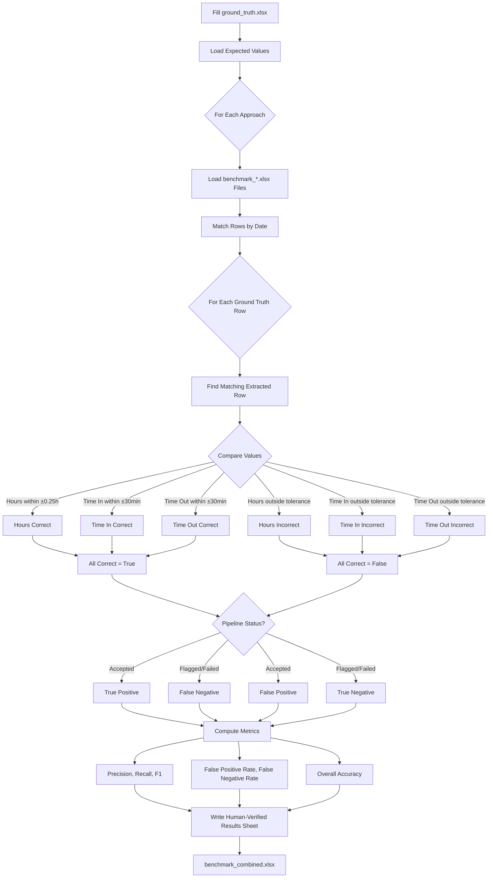

# Ground Truth Comparison Workflow

This workflow validates extraction accuracy by comparing pipeline outputs against manually-annotated ground truth data. It produces a confusion matrix (TP, TN, FP, FN) and derived metrics (Precision, Recall, F1) for each of the 5 extraction approaches.

## Architecture



## Step-by-Step Process

### 1. Prepare Ground Truth Data

Create `output/ground_truth.xlsx` with the following columns:

| Column | Description | Example |
|--------|-------------|---------|
| `source_file` | Original PDF filename | `<patient_1> Timesheets - 010726-011326.pdf` |
| `date` | Date of the shift | `1/7/26` |
| `total_hours` | Expected total hours worked | `8.0` |
| `time_in` | Expected clock-in time | `7:00 AM` |
| `time_out` | Expected clock-out time | `3:00 PM` |
| `employee_name` | Employee/caregiver name | `Jane Smith` |

### 2. Run All 5 Approaches

```bash
python scripts/run_all_approaches.py
```

This generates `benchmark_*.xlsx` files for each approach in their respective output directories.

### 3. Generate Combined Benchmark

```bash
python scripts/create_combined_results.py
```

This creates `output/combined/benchmark_combined.xlsx` with per-file results, page details, and row-level data.

### 4. Compare Against Ground Truth

```bash
uv run python scripts/compare_ground_truth.py
```

This adds a **Human-Verified Results** sheet to `benchmark_combined.xlsx`.

## Confusion Matrix Definitions

| Classification | Pipeline Status | Actually Correct | Meaning |
|---------------|-----------------|------------------|---------|
| **True Positive (TP)** | Accepted | Yes | Pipeline correctly accepted a valid row |
| **True Negative (TN)** | Flagged/Failed | No | Pipeline correctly rejecteded an invalid row |
| **False Positive (FP)** | Accepted | No | Pipeline incorrectly accepted a wrong row (bad) |
| **False Negative (FN)** | Flagged/Failed | Yes | Pipeline incorrectly rejected a correct row (over-cautious) |

## Accuracy Metrics

| Metric | Formula | Interpretation | Ideal |
|--------|---------|----------------|-------|
| **Precision** | TP / (TP + FP) | Of accepted rows, % correct | 100% |
| **Recall** | TP / (TP + FN) | Of correct rows, % accepted | 100% |
| **F1 Score** | 2 × (P × R) / (P + R) | Balance of precision & recall | 1.000 |
| **False Positive Rate** | FP / (FP + TN) | Of wrong rows, % incorrectly accepted | 0% |
| **False Negative Rate** | FN / (TP + FN) | Of correct rows, % incorrectly rejected | 0% |
| **Accuracy** | (TP + TN) / Total | Overall correct classification rate | 100% |

## Tolerance Thresholds

- **Hours**: Within ±0.25 hours (15 minutes)
- **Time In/Out**: Within ±30 minutes
- **All fields must match** for a row to be considered correct

## Output

The `Human-Verified Results` sheet in `benchmark_combined.xlsx` contains:

### Section 1: Accuracy Metrics Table

| Metric | OCR Only | OCR + VLM Fallback | VLM Full Page | Layout-Guided (Local) | Layout-Guided (Cloud) |
|--------|----------|-------------------|---------------|----------------------|----------------------|
| Total Rows Compared | 7 | 7 | 7 | 7 | 7 |
| Row Accuracy | 0.0% | 14.3% | 28.6% | 42.9% | 71.4% |
| Hours Accuracy (±0.25h) | 0.0% | 14.3% | 28.6% | 42.9% | 71.4% |
| True Positives (TP) | 0 | 1 | 2 | 3 | 5 |
| True Negatives (TN) | 0 | 0 | 0 | 0 | 0 |
| False Positives (FP) | 0 | 0 | 0 | 0 | 0 |
| False Negatives (FN) | 0 | 0 | 0 | 0 | 0 |
| Precision | 0.0% | 100.0% | 100.0% | 100.0% | 100.0% |
| Recall | 0.0% | 100.0% | 100.0% | 100.0% | 100.0% |
| F1 Score | 0.000 | 1.000 | 1.000 | 1.000 | 1.000 |
| False Positive Rate | 0.0% | 0.0% | 0.0% | 0.0% | 0.0% |
| False Negative Rate | 0.0% | 0.0% | 0.0% | 0.0% | 0.0% |
| Accuracy | 0.0% | 14.3% | 28.6% | 42.9% | 71.4% |

### Section 2: Per-Row Comparison

| Source File | Date | GT Hours | OCR Only — Hours | OCR Only — Correct? | ... |
|-------------|------|----------|------------------|---------------------|-----|
| patient_a_week1 | 2026-01-07 | 8.0 | 7.5 | YES | ... |
| patient_a_week1 | 2026-01-08 | 8.0 | | NO | ... |

- **Green cells** = Correct extraction (within tolerance)
- **Red cells** = Incorrect extraction (outside tolerance)

## Key Files

| File | Purpose |
|------|---------|
| `output/ground_truth.xlsx` | Manual ground truth data (user-filled, git-ignored) |
| `scripts/compare_ground_truth.py` | Comparison script (computes TP/TN/FP/FN) |
| `output/combined/benchmark_combined.xlsx` | Output with Human-Verified Results sheet |
