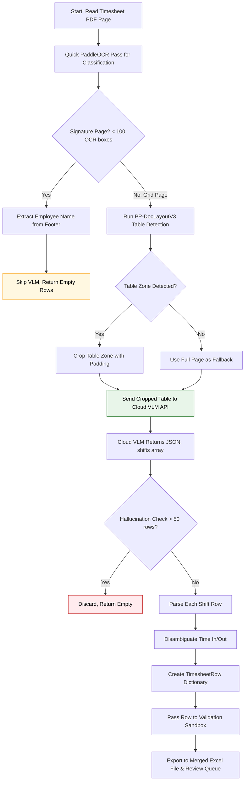

# Layout-Guided VLM (Cloud) Flow (`layout_guided_vlm_cloud`)

This workflow dictates the exact execution pipeline when `extraction_mode` inside `config.yaml` is set to `layout_guided_vlm_cloud`.

This approach uses **PP-DocLayoutV3** to detect and crop the table zone from the timesheet, then sends the cropped table to a **cloud VLM API** (e.g., Google Gemini) for structured JSON extraction. Same layout detection as the local variant, but uses a cloud model for potentially higher accuracy.

## Architecture

## Key Characteristics

| Aspect | Behavior |
|--------|----------|
| OCR role | Page classification only (grid vs signature) |
| Layout detection | PP-DocLayoutV3 detects table zone |
| VLM model | Cloud API (default: Google Gemini `gemini-2.5-flash`) |
| Input to VLM | Cropped table zone (with padding) |
| Anti-hallucination | Discards results with > 50 rows |
| Speed | Fast (cloud inference, no local model load) |
| Accuracy | **Highest** — cloud models have superior handwriting recognition |
| Best use | Maximum accuracy, API key available, no privacy constraints |

## Configuration

- **`cloud_vlm.provider`** — Cloud provider (default: `google`)
- **`cloud_vlm.model`** — Cloud model name (default: `gemini-2.5-flash`)
- **`cloud_vlm.api_key_env`** — Environment variable name for API key
- **`cloud_vlm.timeout_seconds`** — Max wait time per API call
- **`GOOGLE_API_KEY`** — Must be set in `.env` or environment
- **Debug visualization** — Generates `vlm_` prefixed images with extracted text annotations
