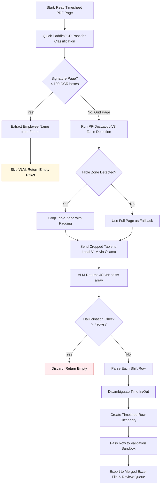

# Layout-Guided VLM (Local) Flow (`layout_guided_vlm_local`)

This workflow dictates the exact execution pipeline when `extraction_mode` inside `config.yaml` is set to `layout_guided_vlm_local`.

This approach uses **PP-DocLayoutV3** to detect and crop the table zone from the timesheet, then sends the cropped table to a **local VLM** (via Ollama) for structured JSON extraction. No PaddleOCR parsing is used — the VLM reads the entire cropped table and returns structured shift data.

## Architecture

## Key Characteristics

| Aspect | Behavior |
|--------|----------|
| OCR role | Page classification only (grid vs signature) |
| Layout detection | PP-DocLayoutV3 detects table zone |
| VLM model | Local via Ollama (e.g., `qwen2.5vl:7b`) |
| Input to VLM | Cropped table zone (with padding) |
| Anti-hallucination | Discards results with > 7 rows |
| Speed | Moderate (layout detection + local VLM) |
| Accuracy | High (VLM reads full table context) |
| Best use | Privacy-first deployment, no cloud API needed |

## Configuration

- **`ollama.model`** — Local VLM model name (default: `qwen2.5vl:7b`)
- **`ollama.host`** — Ollama server URL (default: `http://localhost:11434`)
- **`ollama.timeout_seconds`** — Max wait time per VLM call
- **`layout.table_zone`** — Fallback if PP-DocLayoutV3 fails to detect table
- **Debug visualization** — Generates `vlm_` prefixed images with extracted text annotations
