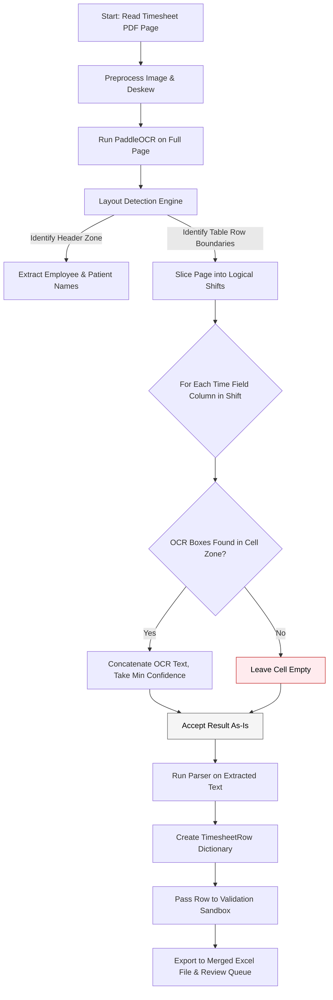

# OCR Only Flow (`ocr_only`)

This workflow dictates the exact execution pipeline when `extraction_mode` inside `config.yaml` is set to `ocr_only`.

This is the **pure baseline** approach — PaddleOCR extracts text from the timesheet grid with **zero VLM involvement**. Empty cells remain empty, low-confidence results are accepted as-is. Useful for measuring the raw OCR capability and establishing a baseline for comparison against VLM-enhanced approaches.

## Architecture

## Key Characteristics

| Aspect | Behavior |
|--------|----------|
| VLM calls | **Zero** — no Ollama, no cloud API |
| Empty cells | Stay empty (no fallback) |
| Low confidence | Accepted as-is (no re-extraction) |
| Speed | **Fastest** — only PaddleOCR inference |
| Accuracy | **Lowest** — struggles with handwritten text |
| Best use | Baseline comparison, printed timesheets |

## Configuration

- **No VLM config needed** — Ollama and cloud VLM settings are ignored
- **Layout zones** — Same `layout:` configuration as `ppocr_grid`
- **Confidence thresholds** — Ignored (no routing decisions made)
- **Debug visualization** — Generates `ocr_only_` prefixed images showing OCR boxes only (no VLM fallback annotations)
