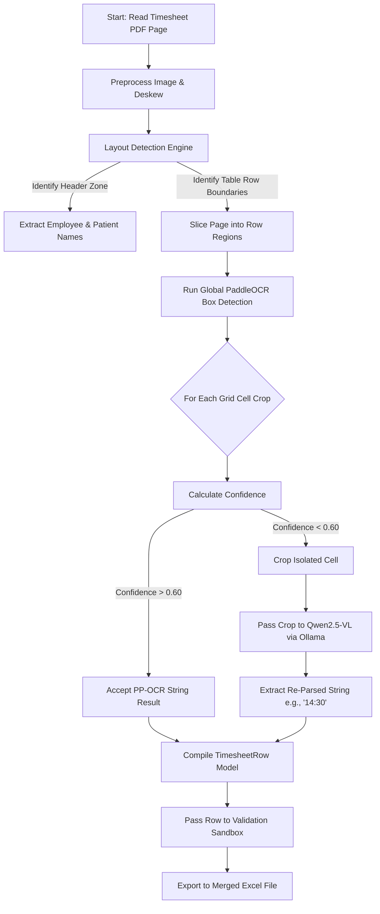

# High-Speed Structured OCR Flow (`ppocr_grid`)

This workflow dictates the exact execution pipeline when `extraction_mode` inside `config.yaml` is set to `ppocr_grid`. 

Because it uses deterministic pixel coordinates to slice the scanned PDF into strict grid rows and runs PaddleOCR over the distinct, isolated crops, it is extremely fast and scalable. Qwen2.5-VL is used purely as an intelligent fallback layer to re-read any illegible cells.

## ⚙️ Architecture

## 🛠️ Configuration
Adjust the strict `layout: columns:` thresholds within `config.yaml` to ensure the bounding boxes correctly envelop your exact timesheet structure. If standard boundaries fail, the `vlm_full_page` mode must be enabled!
