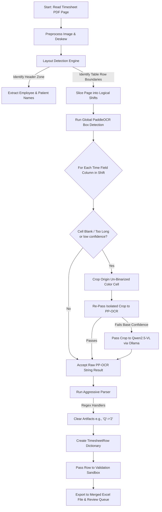

# High-Speed Structured OCR Flow (`ppocr_grid`)

This workflow dictates the exact execution pipeline when `extraction_mode` inside `config.yaml` is set to `ppocr_grid`. 

Because it uses deterministic pixel coordinates to slice the scanned PDF into strict grid rows and runs PaddleOCR over the distinct, isolated crops, it is extremely fast and scalable. Qwen2.5-VL is used purely as an intelligent fallback layer to re-read any illegible cells.

## ⚙️ Architecture

## 🛠️ Configuration & Adjustments

- **Strict Coordinates**: Adjust the `layout: columns:` or `table_zone:` X/Y fractions within `config.yaml` to ensure the bounding boxes correctly envelop your exact timesheet structure.
- **Un-Binarized Cropping**: By operating natively on the origin color image rather than relying on standard black-and-white (binarized/denoised) images, localized cell cropping preserves critical pen-pressure and ink-hue constraints to maximize the PP-OCR fallback capability.
- **Aggressive Time Regex Parsing**: `src/parser.py` scrubs known trailing PaddleOCR noise (like `/20` strings) and directly translates erroneous mapping digits (`Q:` to `2:`) directly within the pipeline flow.

If a provided home-health template is heavily cursive, or entirely skips standard boundaries, the `vlm_full_page` mode must be enabled!
