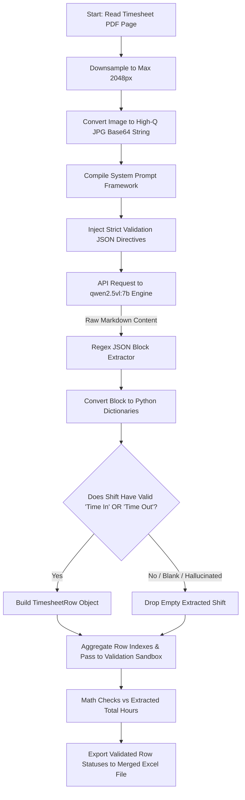

# Deep Contextual Vision-LLM Flow (`vlm_full_page`)

This workflow dictates the exact execution logic when `extraction_mode` inside `config.yaml` is set to `vlm_full_page`.

Because it relies exclusively on Ollama hosting Qwen2.5-VL natively across the entire 1024px downsampled input image, the system **completely bypasses** PaddleOCR and rigid strict-line coordination grids! It allows the Vision Model to deeply understand the spatial intent and structural flow of the document (from signatures to edge-of-paper notes) and output perfectly structured JSON arrays mapping shifts directly to data fields.

## ⚙️ Architecture

## 🛠️ Configuration & Mechanics

- **Grid Agnostic**: When using this mode, the parameters inside `layout` in `config.yaml` are strictly ignored. The system handles table logic dynamically through prompt spatial instructions found within `vlm_fallback.py`.
- **Hallucinated Rows Prevention**: VLM output often generates "Ghost Shifts" corresponding to empty grid slots structurally detected down the table. The pipeline explicitly scrubs output arrays, removing shifts that do not yield physical "Time In" or "Time Out" field strings, avoiding pollution of the unified Excel results table. 
- **Time Complexity Cost**: This execution pipeline utilizes deep context reasoning. Expect ~200–400 seconds per page on CPU with local Ollama. On GPU-backed instances this drops significantly. Only use for heavily chaotic/matrix layout templates.
