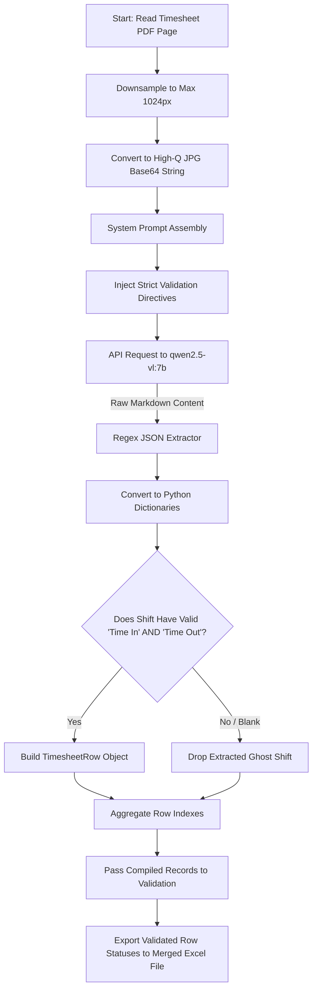

# Deep Contextual Vision-LLM Flow (`vlm_full_page`)

This workflow dictates the exact execution logic when `extraction_mode` inside `config.yaml` is set to `vlm_full_page`.

Because it relies exclusively on Ollama hosting Qwen2.5-VL natively across the entire 1024px downsampled input image, the system completely bypasses PaddleOCR and rigid line coordination grids! It allows the Vision Model to deeply understand the structural intent of the document, even if it is a matrix form or cursive, and output perfectly structured JSON arrays mapping shifts directly to data fields.

## ⚙️ Architecture

## 🛠️ Configuration
When using this mode, the parameters inside `layout` in `config.yaml` are strictly ignored. The system handles table logic dynamically through prompt instructions found within `vlm_fallback.py`.
